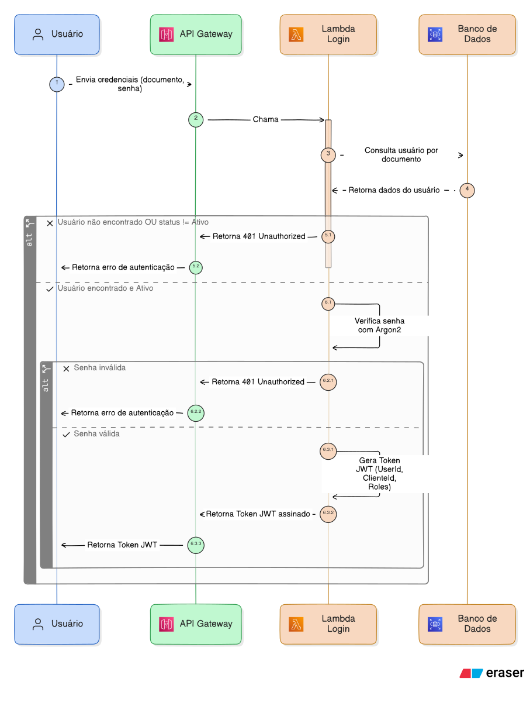

# Fluxo de autenticação

## Login

### Explicação

O Login é o momento onde o usuário informa seu documento e senha, e recebe um token JWT. É feito nos seguintes passos:

1. Endpoint `auth/authenticate` recebe documento do usuário e senha
2. API Gateway chama Lambda Function
3. Lambda busca no banco de dados se usuário existe e está ativo
4. Lambda verifica se a senha do usuário está correta
5. Lambda gera token JWT e retorna através do API Gateway

### Diagrama de sequência

## Autorização

### Explicação

A Autorização é feita em dois momentos, primeiramente pelo próprio API Gateway, que chama um Lambda Authorizer Function, e se ela validar o Token, daí sim a requisição chega na aplicação. Na aplicação, o Token é validado novamente (abordagem zero-trust) pelo framework do .NET, e se valido, é feito a autorização - verificar se aquele usuário autenticado tem permissão para a ação.

Funciona nos seguintes passos:

1. Requisição - com Bearer Token JWT - é feita para qualquer endpoint da aplicação
2. API Gateway chama Lambda Authorizer Function para validar o Token
3. Estando válido, a requisição chega na aplicação
4. A aplicação valida o Token novamente através do framework .NET
5. Estando válido, o módulo de Identidade verifica as roles do usuário
6. O use case específico usa as roles e ownership para permitir que a ação seja feita, ou retorna erro de autorização

### Diagrama de sequência

---
Anterior: [Diagrama de componentes C4](../2.%20Diagramas%20de%20Componentes%20%28C4%29/1_diagrama_de_componentes_c4.md)  
Próximo: [Fluxo de criação de Ordem de Serviço](2_criacao_os.md)