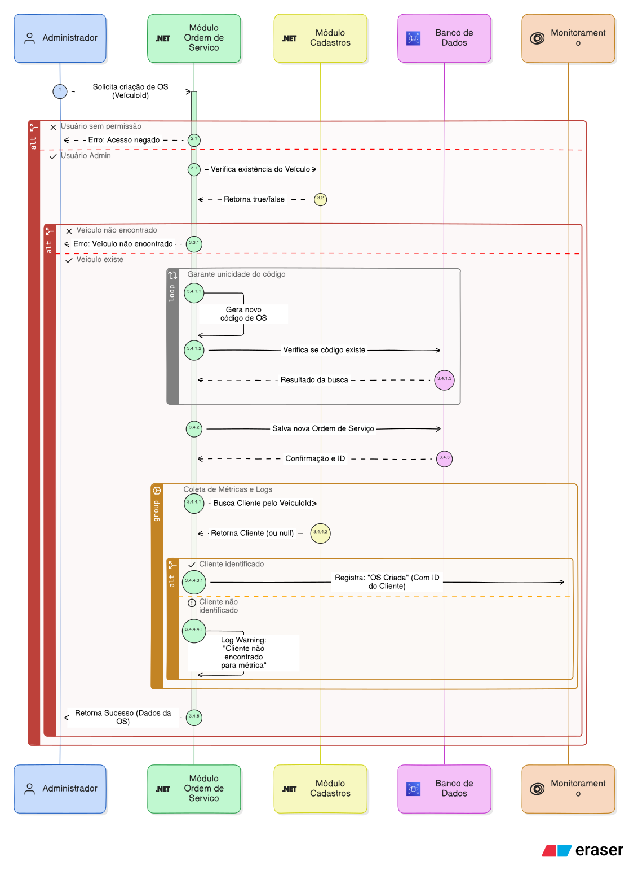
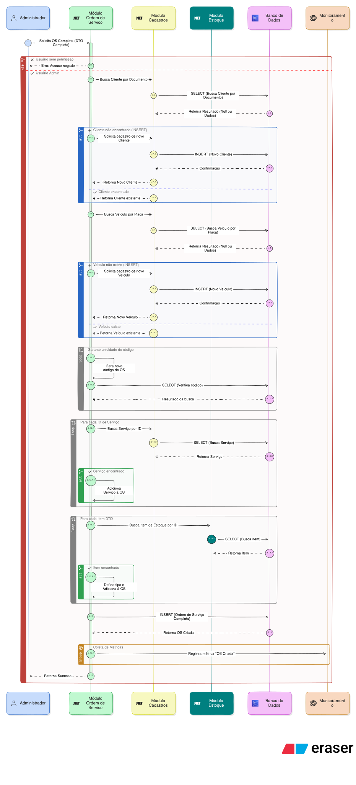

# Fluxo de criação de Ordem de Serviço

## Ordem de Serviço Simples

### Explicação

A criação de uma Ordem de Serviço simples precisa apenas de um `VeiculoId` existente. Acontece nos seguintes passos:

1. Use Case recebe `VeiculoId`
2. Valida se o veículo existe
3. Gera um código para a Ordem de Serviço, valida em loop se esse código já não existe
4. Salvar Ordem de Serviço
5. Gera métricas através do Custom Event `OrdemServicoCriada`

### Diagrama de Sequência

## Ordem de Serviço Completa

### Explicação

A criação de uma Ordem de Serviço Completa pode ser chamada diretamente sem a existência prévia de usuário ou veículo, e também aceita já receber serviços e itens que serão associados. Se as informações de usuário e veículo forem informadas, o sistema busca no banco se já existem, e caso não existam, cria novos registros.

1. Use Case recebe dados de usuário, veículo, serviços e itens
2. Busca ou cria novo usuário
3. Busca ou cria novo veículo
4. Gera um código para a Ordem de Serviço, valida em loop se esse código já não existe
5. Associa serviços
6. Associa itens
7. Salvar Ordem de Serviço
8. Gera métricas através do Custom Event `OrdemServicoCriada`

### Diagrama de Sequência

