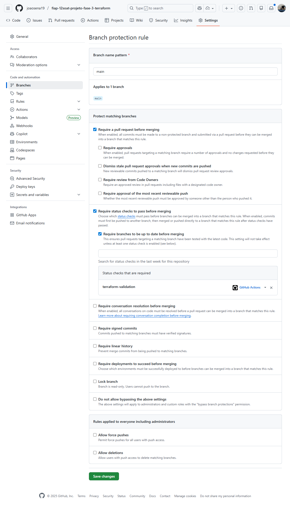

# Proteção de Branches e Proibição de Push Direto

## Status

Aceito

## Contexto

A proteção das branches principais contra push direto é um requisito obrigatório do Tech Challenge. Dessa forma, não houve discussão ou avaliação de alternativas para essa decisão.

Adicionalmente, essa prática já vinha sendo adotada desde a Fase 2, como parte do processo padrão de controle de qualidade e governança do código.

## Decisão

Foi adotada a política de proibição de push direto na branch main, exigindo que toda alteração seja realizada exclusivamente por meio de Pull Requests.

Cada repositório possui uma pipeline de CI dedicada à validação de Pull Requests, chamada `pr-validation.yaml`, localizada em `.github/workflows` de cada um dos repositórios.

A aprovação e o merge de um Pull Request só são permitidos caso a pipeline `pr-validation` seja executada com sucesso.

Além disso, as branches protegidas possuem a regra **“Require pull request before merging”** habilitada.

Exemplo no repositório `fiap-12soat-projeto-fase-3-terraform`:

## Consequências

**Positivas:**

* Garante que nenhuma alteração com erros seja incorporada.

**Negativas:**

* Introduz um pequeno overhead operacional, uma vez que alterações simples não podem ser aplicadas diretamente via push.
