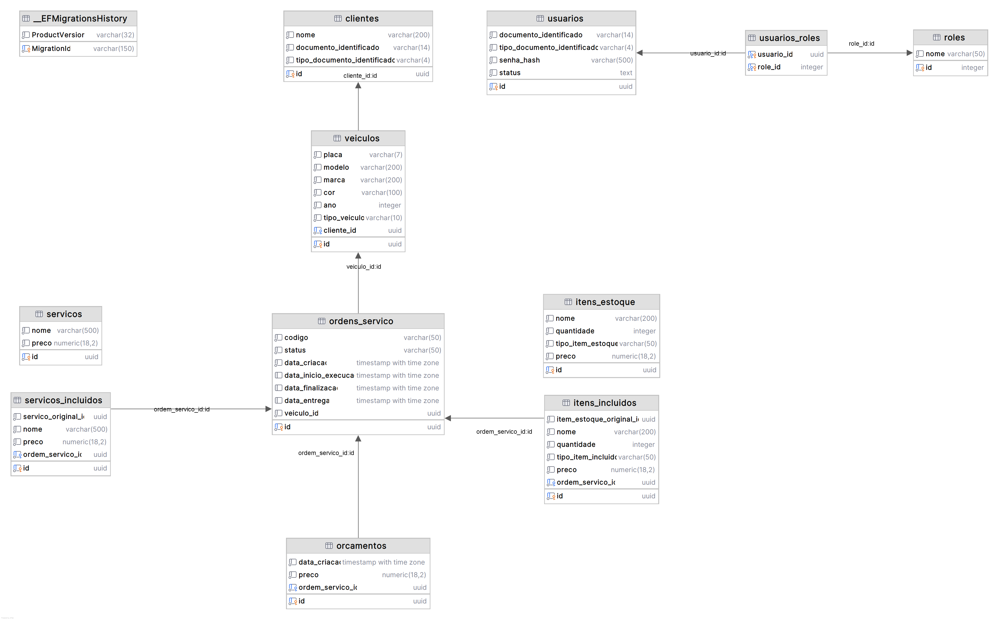

# Modelo de banco de dados

## Escolha do banco de dados
- **Sistema**: PostgreSQL
- **ORM**: Entity Framework Core (API Backend) e Dapper (Lambda Functions)

O motivo da escolha do banco PostgreSQL é por ser um banco relacional, que se encaixa bem com esta aplicação, já que temos diversos relacionamentos entre Cliente, Veículo, Ordem de Serviço etc. e especificamente o Postgre pois é gratuito e facilmente configurável via Docker.

Foi adotada uma abordagem code-first, mapeando as entidades e delegando para o Entity Framework Core a criação das tabelas, definição de campos e relacionamentos.

## Diagrama de Entidade e Relacionamento

## Relacionamentos

### Clientes e Usuários

`clientes` possuem um ou mais `veiculos`. Eles são os donos dos veículos e indiretamente podem ser associados à ordens de serviço.

`usuarios` possuem diversas `roles` através da tabela auxilar `usuarios_roles`. Eles são atores dentro do sistema que realizam ações.

`clientes` e `usuarios` não estão fisicamente ligados, eles são independentes e podem existir um sem um outro. A necessidade disso é que um cliente pode ser cadastrado no sistema sem ele diretamente acessá-lo (e.g.: atendimento de balcão), e o usuário também não necessariamente é ligado a um cliente, pois pode ser apenas um usuário administrador que gerencia o sistema sem nunca atuar como cliente. 

Eventualmente, clientes e usuários podem estar ligados de forma fraca com através da propriedade `documento_identificador`.

### Veículos

`veiculos` possuem uma ou mais `ordens_servico`, e estão associados a somente um `clientes`. 

### Serviços

`servicos` é um catálogo de todos os serviços disponíveis, e usado para gerar `servicos_incluidos`, contudo, sem amarração física.

### Itens de estoque

`itens_estoque` é um catálogo de todos os itens e a quantidade disponível, e usado para gerar `itens_incluidos`, contudo, sem amarração física.

### Ordem de Serviço

`ordens_servico` estão associadas somente a um `veiculos`, e possuem um ou mais `orcamentos`, um ou mais `servicos_incluidos`, um ou mais `itens_incluidos`. 

É importante que existam essas tabelas "cópia" de `servicos_incluidos` e `itens_incluidos` invés de associar diretamente com `servicos` e `itens`. Primeiramente, essas entidades são de domínios diferentes (Ordem de Serviço é um domínio próprio, Serviços pertence ao domínio de Cadastros, e Itens ao domínio de Estoque), e além disso a Ordem de Serviço precisa representar um ponto fixo no tempo, ou seja, se o nome ou preço do serviço/item mudar, ele não pode mudar dentro da Ordem de Serviço, ela deve representar o que foi feito naquele momento do tempo.