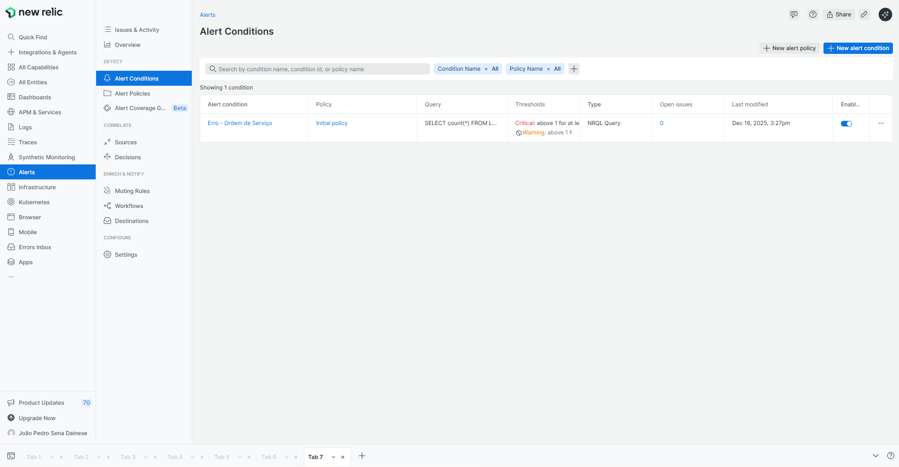

# Plano de monitoramento

## Log estruturado na aplicação

A aplicação utiliza a interface **ILogger** do .NET para registrar logs estruturados. Cada um dos UseCases está dentro de uma lógica de try/catch que captura erros tratados e os loga como Information, e erros inesperados são logados como Error.

Exemplo:

```csharp
    public async Task ExecutarAsync(Ator ator, [... parâmetros do caso de uso ...])
    {
        try
        {
            [... lógica do caso de uso ...]
        }
        catch (DomainException ex)
        {
            logger.ComUseCase(this)
                  .ComAtor(ator)
                  .ComDomainErrorType(ex)
                  .LogInformation(ex.LogTemplate, ex.LogArgs);

            presenter.ApresentarErro(ex.Message, ex.ErrorType);
        }
        catch (Exception ex)
        {
            logger.ComUseCase(this)
                  .ComAtor(ator)
                  .LogError(ex, "Erro interno do servidor.");

            presenter.ApresentarErro("Erro interno do servidor.", ErrorType.UnexpectedError);
        }
    }
```

Foram criados **extension methods** para facilitar a adição de propriedades comuns aos logs, como UseCase, Ator, DomainErrorType, etc.

```csharp
public static class LoggerExtensions
{
    public static IAppLogger ComUseCase(this IAppLogger logger, object useCase)
    {
        var useCaseName = useCase.GetType().Name;
        return logger.ComPropriedade("UseCase", useCaseName);
    }

    public static IAppLogger ComAtor(this IAppLogger logger, Ator ator)
    {
        return logger
            .ComPropriedade("Ator_UsuarioId", ator.UsuarioId)
            .ComPropriedade("Ator_ClienteId", ator.ClienteId)
            .ComPropriedade("Ator_UsuarioRoles", ator.Roles.Select(r => r.ToString()).ToArray());
    }

    public static IAppLogger ComDomainErrorType(this IAppLogger logger, DomainException ex)
    {
        return logger.ComPropriedade("DomainErrorType", ex.ErrorType);
    }
}
```

Assim, todos os logs gerados pela aplicação têm propriedades do Use Case que os gerou e do usuário que estava executando a ação, e podemos filtrar essas propriedades já que elas são indexadas no New Relic como atributos de fato, e não somente texto.

Foi adotado o padrão de que todo erro inesperado em um Use Case deve ser logado como Error, e todo erro tratado (DomainException) deve ser logado como Information. A escolha por Information ao invés de Warning é para evitar poluição com logs de Warning que de fato não são problemas na aplicação, e sim erros do usuário.

## New Relic

O New Relic foi escolhido como plataforma de monitoramento pois é um serviço completo e robusto, que integra facilmente com Kubernetes e AWS, e que tem um plano gratuito generoso que atende completamente o projeto.

Mais detalhes em [ADR 0015 - Monitoramento com New Relic](../4.%20ADRs/0015_adr_monitoramento_com_new_relic.md)

### Dashboard

Este é o dashboard de monitoramento da aplicação no New Relic:

[todo: print do dashboard completo quando estiver pronto]

### Widgets

Estes são os widgets que compõem o dashboard:

#### Healthcheck & Uptime

Monitora a disponibilidade da API através de duas queries, avaliando a taxa de sucesso das requisições e o status do *Readiness Probe* do Kubernetes, indicando se a aplicação está conseguindo atender às requisições.

[todo: print do widget quando estiver pronto]

**Query 1:**
```sql
SELECT percentage(count(*), WHERE httpResponseCode NOT LIKE '5%') as 'Disponibilidade' 
FROM Transaction 
WHERE appName = 'Fiap.Fase3.Oficina.API' 
SINCE 1 hour ago 
TIMESERIES
```

**Query 2:**
```sql
SELECT min(ready) * 100 as 'K8s Readiness Probe' 
FROM K8sContainerSample 
WHERE containerName = 'container-oficina-mecanica-api' 
SINCE 1 hour ago 
TIMESERIES
```

#### Recursos K8s

Acompanha o consumo percentual de CPU e Memória do container em relação aos limites (limits) definidos no Kubernetes.

[todo: print do widget quando estiver pronto]

**Query:**
```sql
SELECT 
  (max(cpuUsedCores) / max(cpuLimitCores)) * 100 as 'CPU %',
  (max(memoryWorkingSetBytes) / max(memoryLimitBytes)) * 100 as 'Memória %'
FROM K8sContainerSample 
WHERE containerName = 'container-oficina-mecanica-api' 
SINCE 1 hour ago 
TIMESERIES
```

#### Latência das APIs

Exibe o tempo médio de resposta das transações.

[todo: print do widget quando estiver pronto]

**Query:**
```sql
SELECT average(duration) * 1000 as 'Latência (ms)' 
FROM Transaction 
WHERE appName = 'Fiap.Fase3.Oficina.API' 
TIMESERIES
```

#### Log de Erros Recentes

Lista os últimos 50 erros e falhas críticos registrados nos logs da aplicação, útil para monitorar erros imediatos.

[todo: print do widget quando estiver pronto]

**Query:**
```sql
SELECT timestamp, message, UseCase, ErrorType 
FROM Log 
WHERE level = 'ERROR' OR level = 'FATAL' 
SINCE 1 day ago 
LIMIT 50
```

#### Top Erros 4xx

Este widget mostra os erros 4xx mais frequentes na aplicação. São erros tratados causados por requisições inválidas dos clientes. É útil para descobrirmos onde os clientes estão errando e melhorar a usabilidade do sistema.

[todo: print do widget quando estiver pronto]

**Query:**
```sql
SELECT count(*) as 'Ocorrências'
FROM Log
WHERE level = 'INFO'
AND traceId IN (
  SELECT traceId FROM Transaction WHERE httpResponseCode LIKE '4%'
)
FACET message_template
SINCE 1 week ago
LIMIT 10
```

#### Volume diário de ordens de serviço

Contabiliza novas ordens de serviço criadas diariamente, comparando com a semana anterior para medir a tendência de demanda do negócio.

É criado na aplicação através do Custom Event `OrdemServicoCriada`.

[todo: print do widget quando estiver pronto]

**Query:**
```sql
SELECT count(*) as 'Qtd Ordens' 
FROM OrdemServicoCriada 
SINCE 1 week ago 
TIMESERIES 1 day 
COMPARE WITH 1 week ago
```

#### Tempo médio de execução de ordens de serviço por status

Calcula o tempo médio que uma OS permanece em certos status antes de avançar. Status analisados: 'Em Diagnóstico', 'Em Execução', 'Finalizada'.

É criado na aplicação através do Custom Event `OrdemServicoMudancaStatus`.

[todo: print do widget quando estiver pronto]

**Query:**
```sql
SELECT average(DuracaoMs) / 1000 / 60 / 60 as 'Horas' 
FROM OrdemServicoMudancaStatus 
FACET StatusAnterior 
SINCE 1 week ago
```

### Alertas

Foi criado um alerta no New Relic para monitorar falhas no processamento de Ordens de Serviço. São consideradas falhas apenas erros do tipo 5xx, pois erros 4xx são esperados de acordo com o input do usuário.

O alerta se baseia na seguinte query:

```sql
SELECT count(*) FROM Log WHERE level = 'ERROR' AND (message LIKE '%OrdemServico%' OR UseCase LIKE '%OrdemServico%')
```

Ele está configurado para abrir um incidente **Critical** se houver mais de 1 erro por 5 minutos, e **Warning** se houver mais de um erro por 1 minuto.

O alerta gera uma notificação por email.



---
Anterior: [Modelo de banco de dados](../5.%20Banco%20de%20dados%20e%20modelo%20ER/1_banco_de_dados_modelo_er.md)  
Próximo: [Autorização](../7.%20Autoriza%C3%A7%C3%A3o/1_autorizacao.md)